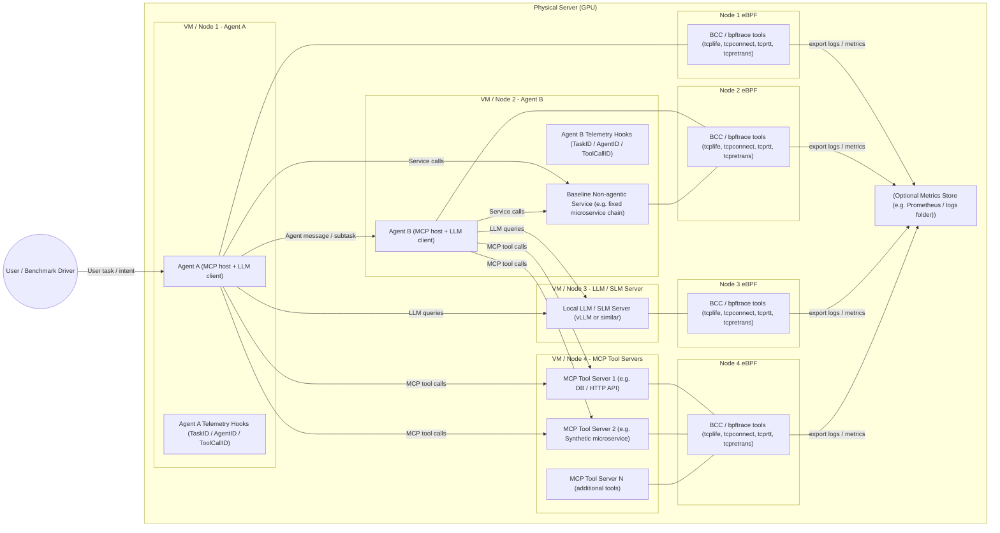

# Agentic Traffic Testbed

This repository contains an **initial testbed** to study how **agentic software** (LLM-powered agents with tools) generates traffic patterns that differ from **non-agentic**, traditional microservice-based applications.

The long-term goal is to characterise, at the **network level (L3/L4)**, how agentic workloads behave: burstiness, RTT distributions, retransmissions, traffic fan-out, and the relationship between semantic workflow (AgentID, TaskID, ToolCallID) and packet/flow-level behaviour.

This MVP runs entirely on a **single GPU server**, using a **virtual multi-node setup** (multiple VMs or lightweight “nodes” on the same host).

---

## Table of contents

- [1. High-level architecture (MVP)](#1-high-level-architecture-mvp)
- [2. What is eBPF and why we use it here](#2-what-is-ebpf-and-why-we-use-it-here)
- [3. Installing eBPF tools (Debian/Ubuntu)](#3-installing-ebpf-tools-debianubuntu)
- [4. Example commands to collect L3/L4 metrics](#4-example-commands-to-collect-l3l4-metrics)
- [5. Experimental idea (MVP)](#5-experimental-idea-mvp)
- [6. Roadmap](#6-roadmap)
- [7. Repository layout](#7-repository-layout)
- [8. LLM config](#8-llm-config)
- [9. Agent endpoints](#9-agent-endpoints)
- [10. Agent config and roles](#10-agent-config-and-roles)
- [11. Chat UI scenarios](#11-chat-ui-scenarios)
- [12. Shared GPU usage checks (read-only)](#12-shared-gpu-usage-checks-read-only)
- [13. Health check script](#13-health-check-script)
- [14. Next steps](#14-next-steps)

---

## 1. High-level architecture (MVP)

The MVP architecture looks like this:



### Components

* **Node 1 – Agent A**

  * Agent A: LLM-based agent (MCP host + LLM client).
  * Emits application-level telemetry: `TaskID`, `AgentID`, `ToolCallID`.

* **Node 2 – Agent B**

  * Agent B: second agent (e.g. planner, tool specialist, summariser).
  * `BaselineSvc`: non-agentic baseline microservice chain (fixed call graph, no LLM).

* **Node 3 – Local LLM / SLM**

  * Local LLM server (e.g. vLLM or similar) serving requests from Agent A and Agent B.

* **Node 4 – MCP Tool Servers** *(separate from agents)*

  * `Tool1` / `Tool2` / `ToolN`: MCP tool servers (e.g. DB, HTTP API, synthetic microservice).
  * Isolated on a separate network to enable traffic analysis of agent ↔ tool communication.

* **Observability**

  * On each node, **eBPF-based tools** (BCC / bpftrace) export:

    * TCP connection lifetimes (`tcplife`)
    * Connection events (`tcpconnect`, `tcpaccept`)
    * RTT distributions (`tcprtt`)
    * Retransmissions (`tcpretrans`)
  * Optional metrics/log store on the host (Prometheus or even just log files).

---

## 2. What is eBPF and why we use it here

**eBPF** lets us attach sandboxed programs to kernel events (network, syscalls) without modifying kernel code. We use BCC/bpftrace to observe L3/L4 metrics per flow (RTT, retransmissions, connection lifetimes) without changing agents or tools.

---

## 3. Installing eBPF tools (Debian/Ubuntu)

On each node, run:

```bash
./scripts/setup/install_ebpf_tools.sh
```

---

## 4. Example commands to collect L3/L4 metrics

On each node:

```bash
sudo tcpconnect    # Watch new TCP connections
sudo tcprtt        # Per-socket RTT
sudo tcplife       # Connection lifetimes
sudo tcpretrans    # Retransmissions
```

Redirect to logs: `sudo tcprtt > logs/tcprtt_node1.log`

---

## 5. Experimental idea (MVP)

1. **Deploy** agents, LLM, and tools across logical nodes (VMs or Docker networks).

2. **Scenarios**: Baseline (no LLM), agentic_simple (Agent A → Tool → LLM), agentic_multi_hop (Agent A → Agent B → tools → LLM).
3. **Run** fixed workloads per scenario; log agent telemetry (TaskID, AgentID, ToolCallID) and eBPF metrics.
4. **Compare** flow counts, RTT distributions, retransmissions, burst patterns.

This gives you the first “traffic-shape” insight for agentic vs non-agentic workloads.

---

## 6. Roadmap

- **Phase 1 (current)**: Single-host MVP with Docker, BCC/bpftrace observability.

- **Phase 2**: Kubernetes + Cilium/Pixie for cluster-wide metrics.
- **Phase 3**: Programmable underlay (Mininet/P4) for congestion studies.

- **Phase 4**: Multi-cluster, cross-domain agent coordination.

 or “”.

---

## 7. Repository layout 


```text
.
├── agents/
│   ├── agent_a/
│   ├── agent_b/
│   └── common/
├── tools/
│   ├── mcp_tool_db/
│   └── mcp_tool_synthetic/
├── baseline/
│   └── service_chain/
├── llm/
│   ├── serve_llm.py
│   ├── config/
│   │   └── llama-3.1-8b.yaml
│   └── Dockerfile
├── infra/
│   └── docker-compose.yml
├── scripts/
│   ├── reset_testbed.sh
│   ├── fetch_endpoints.sh
│   ├── deploy/          # deployment & lifecycle
│   ├── setup/           # prerequisites (Docker, eBPF)
│   ├── experiment/      # run experiments, query agents
│   ├── monitoring/      # health check, metrics
│   ├── traffic/         # traffic collection & analysis
│   └── dev/             # SSH forwarding, multi-VM utilities
├── logs/
│   └── ...
├── requirements.txt
└── README.md
```

See `infra/README.md` for deployment details.

## 8. LLM config

Default model: `meta-llama/Llama-3.1-8B-Instruct`. Run directly:

```bash
pip install -r requirements.txt
python -m llm.serve_llm --model meta-llama/Llama-3.1-8B-Instruct --port 8000
```

Or via Docker / Docker Compose:

```bash
cd infra
docker compose up --build llm-backend
```

Set `LLM_SERVER_URL` (e.g. `http://llm-backend:8000/chat`) for agents. Configure via `infra/.env`:
```text
LLM_MODEL=meta-llama/Llama-3.1-8B-Instruct
LLM_TIMEOUT_SECONDS=120
LLM_MAX_MODEL_LEN=4000
```

Tune vLLM scheduling:
```text
LLM_DTYPE=float16
LLM_MAX_NUM_SEQS=12
LLM_MAX_NUM_BATCHED_TOKENS=8192
LLM_GPU_MEMORY_UTILIZATION=0.90
```

| Variable | Description |
|----------|-------------|
| `LLM_MAX_NUM_SEQS` | Max sequences batched per iteration (controls concurrency) |
| `LLM_MAX_NUM_BATCHED_TOKENS` | Max total tokens in a batch |
| `LLM_GPU_MEMORY_UTILIZATION` | Fraction of GPU memory for vLLM (0-1) |
| `LLM_MAX_MODEL_LEN` | Max context length (prompt + completion tokens) |

Set `LLM_MODEL` in `infra/.env` to change the model. Rebuild with `docker compose up -d --force-recreate llm-backend`.

For gated models, set `HF_TOKEN` (or `HUGGINGFACE_HUB_TOKEN`) in your environment.

## 9. Agent endpoints

**Agent A** (port 8101):

| Endpoint | Method | Description |
|----------|--------|-------------|
| `/task` | POST | Main task endpoint. Agent A may call Agent B and/or LLM based on scenario. |
| `/agentverse` | POST | Full AgentVerse 4-stage workflow (recruitment → decision → execution → evaluation). |

**Agent B** (ports 8102–8106 for multiple instances):

| Endpoint | Method | Description |
|----------|--------|-------------|
| `/subtask` | POST | Receives subtasks from Agent A; calls LLM and returns result. |
| `/discuss` | POST | Alias for `/subtask`. Same payload and behavior; used in AgentVerse collaborative discussions. |

### Quick smoke tests

```bash
# Agent A - single hop (Agent A → LLM)
curl -X POST http://localhost:8101/task \
  -H "Content-Type: application/json" \
  -d '{"task":"Summarise what this testbed is for."}'

# Agent A - multi-hop (Agent A → Agent B → LLM)
curl -X POST http://localhost:8101/task \
  -H "Content-Type: application/json" \
  -d '{"task":"Produce a 3-step plan for RTT metrics.","scenario":"agentic_multi_hop"}'

# Agent A - full AgentVerse workflow (4 stages)
curl -X POST http://localhost:8101/agentverse \
  -H "Content-Type: application/json" \
  -d '{"task":"Design a traffic analysis experiment."}'

# Agent B directly (/subtask or /discuss)
curl -X POST http://localhost:8102/subtask \
  -H "Content-Type: application/json" \
  -d '{"subtask":"List two example MCP tool calls."}'
```

---

## 10. Agent config and roles

### Payload fields

**`/task`** (Agent A):
- `task` (required): User task text.
- `scenario`: `agentic_simple` (default), `agentic_multi_hop`, or `agentic_parallel`.
- `agent_a_role`, `agent_a_contract`: Optional role and contract for Agent A.
- `agent_b_role`, `agent_b_contract`: Optional role and contract for downstream Agent B.
- `agent_count`, `agent_b_workers`: For `agentic_parallel`; control worker count and per-worker endpoints/roles.

**`/agentverse`** (Agent A):
- `task` (required): User task. Triggers full 4-stage workflow.

**`/subtask`** and **`/discuss`** (Agent B):
- `subtask` (required): Subtask text.
- `scenario`: Optional label for telemetry (e.g. `agentic_verse`).
- `agent_b_role`, `agent_b_contract`: Optional. Role and contract applied to this Agent B instance for this request.

### Roles in the codebase

Agent A acts as the **orchestrator** and can recruit Agent B instances with these roles (assigned dynamically via `agent_b_role` or by the AgentVerse recruitment stage):

| Role | Description |
|------|-------------|
| **orchestrator** | Agent A; recruits experts, coordinates decision-making, synthesizes results. |
| **planner** | Plans approach; often acts as solver in vertical (solver+reviewers) mode. |
| **researcher** | Researches and gathers information. |
| **executor** | Executes specific subtasks. |
| **critic** | Critiques proposals; reviewer in vertical mode. |
| **summarizer** | Summarizes discussion or results. |

All Agent B instances run the same code; roles are passed per-request. The **AgentVerse orchestrator** (`agents/agent_a/orchestrator.py`) implements a 4-stage workflow:
1. **Expert recruitment** – LLM decides which roles and how many agents.
2. **Collaborative decision** – Horizontal (democratic discussion) or vertical (solver proposes, reviewers critique).
3. **Action execution** – Experts execute subtasks in parallel.
4. **Evaluation** – Assess results; optionally iterate with feedback.

---

## 11. Chat UI scenarios

Chat UI (`ui/chat/index.html`): Scenario dropdown with `agentic_simple`, `agentic_multi_hop`, `agentic_parallel`, `tool_call`. Only `agentic_multi_hop` and `agentic_parallel` change runtime behavior today.

---

## 12. Shared GPU usage checks (read-only)

```bash
nvidia-smi
nvidia-smi --query-compute-apps=pid,process_name,used_memory --format=csv
```

Avoid killing processes you don't own. If GPU memory is tight, lower model size or run off-peak.

---

## 13. Health check script

```bash
python scripts/monitoring/health_check.py
```

Checks Docker services, LLM connectivity, agent endpoints, and agent-to-LLM (critical path). Use `--skip-docker` when running outside Docker. For DNS/LLM issues, ensure `LLM_SERVER_URL` matches a reachable URL.

---

## 14. Next steps

Immediate next steps to make this repo useful:

1. Implement minimal Agent A and Agent B (even dumb prompts) that:

   * Call MCP tools.
   * Call the local LLM server.
   * Emit `TaskID`, `AgentID`, and `ToolCallID` in logs.

2. Implement a simple non-agentic baseline service.

3. Add scripts to:

   * Run one scenario at a time.
   * Start eBPF probes.
   * Dump all logs into `logs/` with timestamps.


