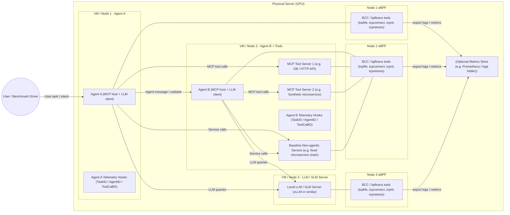

# Agentic Traffic Testbed

This repository contains an **initial testbed** to study how **agentic software** (LLM-powered agents with tools) generates traffic patterns that differ from **non-agentic**, traditional microservice-based applications.

The long-term goal is to characterise, at the **network level (L3/L4)**, how agentic workloads behave: burstiness, RTT distributions, retransmissions, traffic fan-out, and the relationship between semantic workflow (AgentID, TaskID, ToolCallID) and packet/flow-level behaviour.

This MVP runs entirely on a **single GPU server**, using a **virtual multi-node setup** (multiple VMs or lightweight “nodes” on the same host).

---

## Table of contents

- [1. High-level architecture (MVP)](#1-high-level-architecture-mvp)
- [2. What is eBPF and why we use it here](#2-what-is-ebpf-and-why-we-use-it-here)
- [3. Installing eBPF tools (Debian/Ubuntu)](#3-installing-ebpf-tools-debianubuntu)
- [4. Example commands to collect L3/L4 metrics](#4-example-commands-to-collect-l3l4-metrics)
- [5. Experimental idea (MVP)](#5-experimental-idea-mvp)
- [6. Roadmap / Next Phases](#6-roadmap--next-phases)
- [7. Repository layout](#7-repository-layout)
- [8. LLM config](#8-llm-config)
- [9. Quick HTTP smoke test (curl)](#9-quick-http-smoke-test-curl)
- [10. Chat UI scenarios](#10-chat-ui-scenarios)
- [11. Shared GPU usage checks (read-only)](#11-shared-gpu-usage-checks-read-only)
- [12. Health check script](#12-health-check-script)
- [13. Next steps](#13-next-steps)

---

## 1. High-level architecture (MVP)

The MVP architecture looks like this:



### Components

* **Node 1 – Agent A**

  * Agent A: LLM-based agent (MCP host + LLM client).
  * Emits application-level telemetry: `TaskID`, `AgentID`, `ToolCallID`.

* **Node 2 – Agent B + Tools**

  * Agent B: second agent (e.g. planner, tool specialist, summariser).
  * `Tool1` / `Tool2`: MCP tool servers (e.g. DB, HTTP API, synthetic microservice).
  * `BaselineSvc`: non-agentic baseline microservice chain (fixed call graph, no LLM).

* **Node 3 – Local LLM / SLM**

  * Local LLM server (e.g. vLLM or similar) serving requests from Agent A and Agent B.

* **Observability**

  * On each node, **eBPF-based tools** (BCC / bpftrace) export:

    * TCP connection lifetimes (`tcplife`)
    * Connection events (`tcpconnect`, `tcpaccept`)
    * RTT distributions (`tcprtt`)
    * Retransmissions (`tcpretrans`)
  * Optional metrics/log store on the host (Prometheus or even just log files).

---

## 2. What is eBPF and why we use it here

**eBPF (extended Berkeley Packet Filter)** is a Linux kernel mechanism that lets us attach safe, sandboxed programs to events in the kernel (e.g. network, syscalls) without changing kernel code.

In this project it is used to observe:

* **L3/L4 metrics per flow**:

  * RTT distributions
  * Retransmissions
  * Connection lifetimes
  * Flow creation and teardown
* Without modifying the agents or the tools.

We rely on **BCC** and **bpftrace** utilities to avoid writing raw eBPF code.

---

## 3. Installing eBPF tools (Debian/Ubuntu)

On each node (or inside each VM), run the following script to install the basic toolchain.

Save this as `scripts/install_ebpf_tools.sh`:

```bash
#!/usr/bin/env bash
set -euo pipefail

echo "[*] Installing eBPF tools (BCC and bpftrace)..."

if ! command -v apt &>/dev/null; then
  echo "This script currently supports apt-based systems (Debian/Ubuntu)."
  exit 1
fi

sudo apt update

# Kernel headers for building eBPF probes
sudo apt install -y "linux-headers-$(uname -r)" || true

# BCC (bpfcc-tools) and Python bindings
sudo apt install -y bpfcc-tools python3-bpfcc

# bpftrace for quick custom scripts
sudo apt install -y bpftrace

echo "[*] Installed packages:"
dpkg -l | grep -E "bpfcc|bpftrace" || true

echo "[*] Quick sanity checks (these may print usage and exit):"
if command -v tcplife >/dev/null 2>&1; then
  tcplife -h | head -n 1 || true
fi
if command -v tcpconnect >/dev/null 2>&1; then
  tcpconnect -h | head -n 1 || true
fi

echo "[*] eBPF tools installation complete."
```

Make it executable:

```bash
chmod +x scripts/install_ebpf_tools.sh
./scripts/install_ebpf_tools.sh
```

---

## 4. Example commands to collect L3/L4 metrics

Once the tools are installed, you can run these on each node:

### Watch new TCP connections (who talks to whom)

```bash
sudo tcpconnect
```

### Measure TCP RTT in real time

```bash
sudo tcprtt
```

This gives per-socket RTT, which you can sample while running agentic workloads.

### See connection lifetimes

```bash
sudo tcplife
```

Helps compare agentic workflows vs baseline microservices (depth and chattiness).

### Monitor retransmissions

```bash
sudo tcpretrans
```

Useful when you introduce synthetic congestion or run heavy agentic traffic.

You can redirect output to logs for later analysis:

```bash
sudo tcprtt > logs/tcprtt_node1_agentA.log
```

---

## 5. Experimental idea (MVP)

For a single GPU server with 3 local nodes:

1. **Deploy:**

   * Node 1: Agent A.
   * Node 2: Agent B, MCP tool servers, and the non-agentic baseline service.
   * Node 3: Local LLM / SLM server.

2. **Define scenarios:**

   * Baseline: client → BaselineSvc (no LLM, fixed microservice path).
   * Agentic (simple): Agent A → Tool1 → LLM → response.
   * Agentic (multi-hop): Agent A → Agent B → Tool1/Tool2 → LLM → response.

3. **Run workload:**

   * For each scenario, run a fixed request set (e.g. same user profiles / tasks).
   * Log:

     * Agent-level telemetry: TaskID, AgentID, ToolCallID.
     * eBPF metrics from each node.

4. **Compare:**

   * Flow counts per task.
   * RTT distributions and tails.
   * Retransmission rates under load.
   * Traffic burst patterns (number and size of packets per task).

This gives you the first “traffic-shape” insight for agentic vs non-agentic workloads.

---

## 6. Roadmap / Next Phases

This repo initially targets the **single-host, multi-node MVP** described above.
Future phases build on the same core idea but add realism and complexity.

### Phase 1 – Current MVP (this repo)

* Single GPU host with multiple virtual nodes (VMs / containers).
* Two agents (Agent A, Agent B) using MCP tools.
* Local LLM server (vLLM or similar).
* eBPF-based L3/L4 observability with BCC / bpftrace.
* Non-agentic baseline service for comparison.

### Phase 2 – Kubernetes-based deployment

* Replace VM-based nodes with a **Kubernetes cluster** (kind, k3s, or full K8s).
* Agents and tools become **pods**; LLM server becomes a **service**.
* Introduce:

  * **Cilium** as CNI for eBPF-powered flow logs.
  * **Pixie** for cluster-wide TCP RTT, retransmissions, and L7 telemetry.
* Keep the same agent vs baseline comparison, but now across pods and services.

### Phase 3 – Programmable underlay / network emulation

* Introduce a **programmable data plane**:

  * Mininet for controllable topologies, or
  * P4 / INT for per-hop latency and queue measurements.
* Connect K8s nodes through this emulated underlay.
* Study how:

  * Agentic fan-out, branching, and tool chains interact with congestion.
  * Different routing / scheduling policies impact agentic QoS.

### Phase 4 – Multi-cluster and cross-domain scenarios

* Deploy agents across **multiple clusters** or “domains”.
* Use cluster-mesh / VPN / overlay networks.
* Explore:

  * Cross-cluster agent coordination.
  * Inter-domain policy, latency, and reliability impact on agent workflows.
  * How semantic routing or intent-based networking could prioritise agentic flows.

---

## 7. Repository layout 


```text
.
├── agents/
│   ├── agent_a/
│   ├── agent_b/
│   └── common/
├── tools/
│   ├── mcp_tool_db/
│   └── mcp_tool_synthetic/
├── baseline/
│   └── service_chain/
├── llm/
│   ├── serve_llm.py
│   ├── config/
│   │   └── llama-3.1-8b.yaml
│   └── Dockerfile
├── llm_server/
│   └── server.py
├── infra/
│   └── docker-compose.yml
├── scripts/
│   ├── install_ebpf_tools.sh
│   ├── run_mvp_experiment.sh
│   └── collect_metrics.sh
├── logs/
│   └── ...
├── requirements.txt
└── README.md
```

`agents/` hosts Agent A and B. `llm/` contains the local vLLM backend. `infra/` has Docker Compose definitions, and `scripts/` includes helper utilities for running experiments and collecting metrics.

## 8. LLM config

The local LLM backend uses vLLM and defaults to:

```text
meta-llama/Llama-3.1-8B-Instruct
```

Run it directly:

```bash
pip install -r requirements.txt
python -m llm.serve_llm --model meta-llama/Llama-3.1-8B-Instruct --port 8000
```

Or via Docker / Docker Compose:

```bash
cd infra
docker compose up --build llm-backend
```

Agents can point at this backend by setting `LLM_SERVER_URL`, e.g.:

```bash
export LLM_SERVER_URL="http://llm-backend:8000/chat"
```

### LLM runtime settings (.env)

Place the `.env` file in the `infra/` directory so Docker Compose picks it up automatically.
You can add runtime overrides to that file:
```text
LLM_MODEL=meta-llama/Llama-3.1-8B-Instruct
LLM_TIMEOUT_SECONDS=120
LLM_MAX_MODEL_LEN=4000
```

The LLM backend uses **AsyncLLMEngine** for true request batching — concurrent requests are automatically batched together by vLLM's scheduler for GPU efficiency.

Tune vLLM scheduling with:
```text
LLM_DTYPE=float16
LLM_MAX_NUM_SEQS=12
LLM_MAX_NUM_BATCHED_TOKENS=8192
LLM_GPU_MEMORY_UTILIZATION=0.90
```

| Variable | Description |
|----------|-------------|
| `LLM_MAX_NUM_SEQS` | Max sequences batched per iteration (controls concurrency) |
| `LLM_MAX_NUM_BATCHED_TOKENS` | Max total tokens in a batch |
| `LLM_GPU_MEMORY_UTILIZATION` | Fraction of GPU memory for vLLM (0-1) |
| `LLM_MAX_MODEL_LEN` | Max context length (prompt + completion tokens) |

### Understanding KV cache and concurrency limits

At startup, vLLM logs useful information about your GPU's capacity:

```
Available KV cache memory: 2.73 GiB
GPU KV cache size: 22,320 tokens
Maximum concurrency for 4,096 tokens per request: 5.45x
```

**What this means:**
- After loading the model, 2.73 GB of GPU RAM remains for the KV cache (key-value cache used during inference)
- The KV cache can hold 22,320 tokens total across all concurrent requests
- With `max_model_len=4096`, the GPU can handle ~5.45 concurrent requests before queuing

**The formula:**
```
max_concurrency ≈ KV_cache_tokens ÷ max_model_len
```

**If you need more concurrency:**
| Action | Effect |
|--------|--------|
| Reduce `LLM_MAX_MODEL_LEN` (e.g., 2048) | ~2x more concurrent requests |
| Increase `LLM_GPU_MEMORY_UTILIZATION` | More KV cache (but risk OOM) |
| Use a smaller model | More free VRAM for KV cache |

Note: `LLM_MAX_NUM_SEQS` sets a *soft* limit on batching. The actual limit is determined by available KV cache memory. If you set `LLM_MAX_NUM_SEQS=12` but only have KV cache for 5 requests, vLLM will queue the rest automatically.

### Changing the model served by llm-backend

The model is controlled by the `LLM_MODEL` environment variable. The default is:

```text
meta-llama/Llama-3.1-8B-Instruct
```

To serve another model, set `LLM_MODEL` in your `.env` file (in `infra/`):
```text
LLM_MODEL=meta-llama/Llama-3.2-3B-Instruct
```

Then rebuild/restart:
```bash
cd infra
docker compose up -d --force-recreate llm-backend
```

All launch paths (`docker-compose.yml`, `serve_llm.py`, `hf_cpu_server.py`) now read `LLM_MODEL` from the environment, so you only need to set it once.

### Hugging Face Token setup

If the model is gated on Hugging Face, set `HF_TOKEN` in your shell so Compose passes it through to the container. For compatibility, you can also export `HUGGINGFACE_HUB_TOKEN` and `HUGGINGFACE_HUB_TOKE` (we mirror the same value across all three).

Note: `HF_TOKEN` takes precedence. If it is set but invalid, the container will still fail even if `HUGGINGFACE_HUB_TOKEN` is valid.

You can evolve this as you move into Kubernetes and programmable networks.

## 9. Quick HTTP smoke test (curl)

Once the stack is running (e.g. `cd infra && docker compose up --build -d llm-backend agent-a agent-b`), you can hit the HTTP endpoints directly. Replace `localhost` with the host that exposes the ports if you are forwarding them from another node.

- Agent A → LLM (single-hop):
```bash
curl -X POST http://localhost:8101/task \
  -H "Content-Type: application/json" \
  -d '{"task":"Summarise what this testbed is for."}'
```

- Agent A → Agent B → LLM (multi-hop): add `scenario=agentic_multi_hop` to have Agent A iterate with Agent B before answering.
```bash
curl -X POST http://localhost:8101/task \
  -H "Content-Type: application/json" \
  -d '{"task":"Produce a 3-step plan to collect RTT metrics with eBPF.","scenario":"agentic_multi_hop"}'
```

- Agent B directly:
```bash
curl -X POST http://localhost:8102/subtask \
  -H "Content-Type: application/json" \
  -d '{"subtask":"List two example MCP tool calls for troubleshooting."}'
```

The `task` field is required for Agent A, `subtask` for Agent B. `scenario` is optional; use `agentic_multi_hop` to trigger Agent B participation from Agent A.

---

## 10. Chat UI scenarios

The chat UI (`ui/chat/index.html`) exposes a Scenario dropdown with:

- `agentic_simple`: agent-to-LLM single hop.
- `agentic_multi_hop`: Agent A calls Agent B before answering (behavioral change).
- `agentic_parallel`: Agent A fans out into parallel Agent B workers and then synthesizes a final response.
- `tool_call`: placeholder for routing the query to an MCP tool adapted to the task (not implemented yet).

Only `agentic_multi_hop` and `agentic_parallel` change runtime behavior today; `agentic_simple` and `tool_call` are labels used for telemetry and future experiment tracking.

---

## 11. Shared GPU usage checks (read-only)

This server is shared. Before running workloads, **check GPU usage and memory without disrupting other users**:

```bash
# Summary of GPU utilization and memory usage
nvidia-smi
```

```bash
# Per-process GPU memory usage (helps identify active users)
nvidia-smi --query-compute-apps=pid,process_name,used_memory --format=csv
```

```bash
# Continuous view (press q to exit)
watch -n 1 nvidia-smi
```

Avoid killing or restarting processes you do not own. If GPU memory is tight, lower model size or run during off-peak hours.

---

## 12. Health check script

The `scripts/health_check.py` script provides comprehensive health checks for the entire testbed. It verifies:

- **Docker Compose services**: Checks if all containers are running
- **LLM server connectivity**: Verifies the LLM server is reachable and responding
- **Agent endpoints**: Tests Agent A and Agent B HTTP endpoints
- **Agent-to-LLM connectivity**: **Critical path check** - verifies agents can successfully call the LLM (this catches DNS resolution failures and connection issues)
- **UI endpoint**: Checks if the chat console is accessible
- **DNS resolution**: Validates hostname resolution for container names

### Usage

Basic health check (uses default endpoints):
```bash
python scripts/health_check.py
```

With custom endpoints:
```bash
python scripts/health_check.py \
  --llm-url http://llm-backend:8000/chat \
  --agent-a-url http://localhost:8101/task \
  --agent-b-url http://localhost:8102/subtask
```

Skip Docker checks (useful when running services outside Docker):
```bash
python scripts/health_check.py --skip-docker
```

### Common issues detected

The health check script specifically identifies:

1. **DNS resolution failures**: If agents cannot resolve the LLM hostname (e.g., `llm-backend`), you'll see:
   ```
   ✗ Agent A can reach LLM
     Error: Agent cannot resolve LLM hostname. Error: ...
   ```
   **Fix**: Ensure `LLM_SERVER_URL` environment variable matches a reachable URL. In Docker Compose, use `http://llm-backend:8000/chat`. For local testing, use `http://localhost:8000/chat`.

2. **LLM server not running**: The script will detect if the LLM server is unreachable.

3. **Port conflicts**: If endpoints don't respond, check if ports are already in use.

4. **Service startup issues**: Docker Compose service checks reveal if containers failed to start.

### Example output

```
============================================================
Docker Compose Services
============================================================

✓ Docker service: llm-backend (running)
✓ Docker service: agent-a (running)
✓ Docker service: agent-b (running)
✓ Docker service: chat-ui (running)

============================================================
LLM Server
============================================================

✓ LLM Server (http://localhost:8000/chat)

============================================================
Agent A
============================================================

✓ Agent A endpoint (http://localhost:8101/task)

============================================================
Agent A → LLM Connectivity (Critical Path)
============================================================

✓ Agent A can reach LLM (successful end-to-end test)

============================================================
Summary
============================================================

✓ All critical checks passed!
```

If checks fail, the script provides specific error messages and troubleshooting suggestions.

---

## 13. Next steps

Immediate next steps to make this repo useful:

1. Implement minimal Agent A and Agent B (even dumb prompts) that:

   * Call MCP tools.
   * Call the local LLM server.
   * Emit `TaskID`, `AgentID`, and `ToolCallID` in logs.

2. Implement a simple non-agentic baseline service.

3. Add scripts to:

   * Run one scenario at a time.
   * Start eBPF probes.
   * Dump all logs into `logs/` with timestamps.


