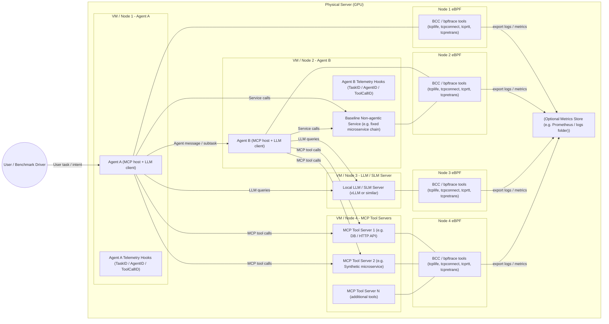

# Agentic Traffic Testbed

This repository contains an **initial testbed** to study how **agentic software** (LLM-powered agents with tools) generates traffic patterns that differ from **non-agentic**, traditional microservice-based applications.

The long-term goal is to characterise, at the **network level (L3/L4)**, how agentic workloads behave: burstiness, RTT distributions, retransmissions, traffic fan-out, and the relationship between semantic workflow (AgentID, TaskID, ToolCallID) and packet/flow-level behaviour.

This MVP runs entirely on a **single GPU server**, using a **virtual multi-node setup** (multiple VMs or lightweight “nodes” on the same host).

---

## Table of contents

- [1. High-level architecture (MVP)](#1-high-level-architecture-mvp)
- [Split-host deployment (k3s + Saturn)](#split-host-deployment-k3s--saturn)
- [2. What is eBPF and why we use it here](#2-what-is-ebpf-and-why-we-use-it-here)
  - [Installing eBPF tools (Debian/Ubuntu)](#installing-ebpf-tools-debianubuntu)
  - [Example commands to collect L3/L4 metrics](#example-commands-to-collect-l3l4-metrics)
- [3. Repository layout](#3-repository-layout)
- [4. LLM config](#4-llm-config)
- [5. Agent endpoints](#5-agent-endpoints)
- [6. Agent config and roles](#6-agent-config-and-roles)
- [7. Shared GPU usage checks (read-only)](#7-shared-gpu-usage-checks-read-only)
- [8. Health check script](#8-health-check-script)
- [9. MCP-Universe benchmark integration](#9-mcp-universe-benchmark-integration)

---

## 1. High-level architecture (MVP)

The MVP architecture looks like this:


```mermaid
flowchart LR
    %% Physical host
    subgraph Host["Physical Server (GPU)"]
        
        %% Virtual node 1: Agent A
        subgraph Node1["VM / Node 1 - Agent A"]
            AgentA["Agent A (MCP host + LLM client)"]
            AgentALogger["Agent A Telemetry Hooks (TaskID / AgentID / ToolCallID)"]
        end

        %% Virtual node 2: Agent B
        subgraph Node2["VM / Node 2 - Agent B"]
            AgentB["Agent B (MCP host + LLM client)"]
            BaselineSvc["Baseline Non-agentic Service (e.g. fixed microservice chain)"]
            AgentBLogger["Agent B Telemetry Hooks (TaskID / AgentID / ToolCallID)"]
        end

        %% Virtual node 3: Local LLM / SLM server
        subgraph Node3["VM / Node 3 - LLM / SLM Server"]
            LLM["Local LLM / SLM Server (vLLM or similar)"]
        end

        %% Virtual node 4: MCP Tool Servers
        subgraph Node4["VM / Node 4 - MCP Tool Servers"]
            Tool1["MCP Tool Server 1 (e.g. DB / HTTP API)"]
            Tool2["MCP Tool Server 2 (e.g. Synthetic microservice)"]
            ToolN["MCP Tool Server N (additional tools)"]
        end

        %% eBPF observability on each node
        subgraph Obs1["Node 1 eBPF"]
            BCC1["BCC / bpftrace tools (tcplife, tcpconnect, tcprtt, tcpretrans)"]
        end

        subgraph Obs2["Node 2 eBPF"]
            BCC2["BCC / bpftrace tools (tcplife, tcpconnect, tcprtt, tcpretrans)"]
        end

        subgraph Obs3["Node 3 eBPF"]
            BCC3["BCC / bpftrace tools (tcplife, tcpconnect, tcprtt, tcpretrans)"]
        end

        subgraph Obs4["Node 4 eBPF"]
            BCC4["BCC / bpftrace tools (tcplife, tcpconnect, tcprtt, tcpretrans)"]
        end

        %% Optional metrics store on host
        MetricsDB["(Optional Metrics Store (e.g. Prometheus / logs folder))"]
    end

    %% Traffic paths (logical)
    User((User / Benchmark Driver)) -->|User task / intent| AgentA
    AgentA -->|Agent message / subtask| AgentB
    AgentA -->|MCP tool calls| Tool1
    AgentA -->|MCP tool calls| Tool2
    AgentB -->|MCP tool calls| Tool1
    AgentB -->|MCP tool calls| Tool2
    AgentA -->|Service calls| BaselineSvc
    AgentB -->|Service calls| BaselineSvc

    AgentA -->|LLM queries| LLM
    AgentB -->|LLM queries| LLM

    %% eBPF data flow
    AgentA --- BCC1
    AgentB --- BCC2
    BaselineSvc --- BCC2
    LLM --- BCC3
    Tool1 --- BCC4
    Tool2 --- BCC4
    ToolN --- BCC4

    BCC1 -->|export logs / metrics| MetricsDB
    BCC2 -->|export logs / metrics| MetricsDB
    BCC3 -->|export logs / metrics| MetricsDB
    BCC4 -->|export logs / metrics| MetricsDB
```

### Components

* **Node 1 – Agent A**

  * Agent A: LLM-based agent (MCP host + LLM client).
  * Emits application-level telemetry: `TaskID`, `AgentID`, `ToolCallID`.

* **Node 2 – Agent B**

  * Agent B: second agent (e.g. planner, tool specialist, summariser).
  * `BaselineSvc`: non-agentic baseline microservice chain (fixed call graph, no LLM).

* **Node 3 – Local LLM / SLM**

  * Local LLM server (e.g. vLLM or similar) serving requests from Agent A and Agent B.

* **Node 4 – MCP Tool Servers** *(separate from agents)*

  * `Tool1` / `Tool2` / `ToolN`: MCP tool servers (e.g. DB, HTTP API, synthetic microservice).
  * Isolated on a separate network to enable traffic analysis of agent ↔ tool communication.

* **Observability**

  * On each node, **eBPF-based tools** (BCC / bpftrace) export:

    * TCP connection lifetimes (`tcplife`)
    * Connection events (`tcpconnect`, `tcpaccept`)
    * RTT distributions (`tcprtt`)
    * Retransmissions (`tcpretrans`)
  * **Metrics and dashboards**: an optional Prometheus + Grafana + cAdvisor stack (enabled via `ENABLE_MONITORING=1` in `infra/.env`) scrapes:
    * `cAdvisor` for container-level `container_*` CPU, memory, and network metrics.
    * `llm-backend`'s `/metrics` endpoint for `llm_*` latency/throughput metrics.
    * `scripts/monitoring/tcp_metrics_collector.py` for `tcp_*` metrics on the `inter_agent_network`, exposed via a Prometheus `/metrics` endpoint on port `9100`.
  * See `docs/monitoring.md` for full details on enabling and using monitoring.

### Split-host deployment (k3s + Saturn)

In addition to the single-host MVP above, the repo supports a **split-host deployment**:

- **Saturn (`SATURN_LLM_HOST` in `infra/.env`)** runs the **LLM backend** (vLLM) with GPU.
- A separate **k3s server** (configured via `K3S_NODE_HOST` in `infra/.env`) runs:
  - Agent A and Agent B as Kubernetes Deployments.
  - MCP tools (e.g. `mcp-tool-db`).
  - Prometheus + Grafana via `kube-prometheus-stack`.
  - Cilium + Hubble for L3/L4 flow observability.
  - Jaeger for traces.

The agents call the remote LLM over the university network:

- `LLM_SERVER_URL=http://${SATURN_LLM_HOST}:${SATURN_LLM_PORT}/chat`

Prometheus in the k3s cluster scrapes LLM metrics directly from Saturn:

- `http://${SATURN_LLM_HOST}:${SATURN_LLM_PORT}/metrics`

**What Hubble sees in this architecture:**

- Full service‑pair visibility for **intra‑cluster** traffic (Agent A ↔ Agent B, agents ↔ MCP tools, etc.).
- Agent‑to‑LLM calls show up as **egress flows** to an external IP (Saturn), not as a named in‑cluster service.
- LLM performance metrics (latency, TTFT, tokens/s) are still fully available via the Prometheus scrape of Saturn’s `/metrics`.

**How to deploy this split-host setup:**

- On **Saturn**: use Docker Compose via `scripts/deploy/deploy_llm.sh` to start only the `llm-backend` service.
- On the **k3s node**:
  - Run `scripts/monitoring/test_llm_connectivity.sh` to verify reachability to Saturn.
  - Run `scripts/deploy/deploy_cluster.sh` to install k3s + Cilium + Hubble, build/load images, and deploy agents/tools/Jaeger.

For detailed, step‑by‑step instructions see:

- `docs/deploy_k3s_cluster_and_saturn.md`
- `docs/k3s_cilium_migration.md`

---

## 2. What is eBPF and why we use it here

**eBPF** lets us attach sandboxed programs to kernel events (network, syscalls) without modifying kernel code. We use BCC/bpftrace to observe L3/L4 metrics per flow (RTT, retransmissions, connection lifetimes) without changing agents or tools.

### Installing eBPF tools (Debian/Ubuntu)

On each node, run:

```bash
./scripts/setup/install_ebpf_tools.sh
```

### Example commands to collect L3/L4 metrics

On each node:

```bash
sudo tcpconnect    # Watch new TCP connections
sudo tcprtt        # Per-socket RTT
sudo tcplife       # Connection lifetimes
sudo tcpretrans    # Retransmissions
```

Redirect to logs: `sudo tcprtt > logs/tcprtt_node1.log`

---

## 3. Repository layout 


```text
.
├── agents/
│   ├── agent_a/
│   ├── agent_b/
│   └── common/
├── tools/
│   ├── mcp_tool_db/
│   └── mcp_tool_synthetic/
├── baseline/
│   └── service_chain/
├── llm/
│   ├── serve_llm.py
│   ├── config/
│   │   └── llama-3.1-8b.yaml
│   └── Dockerfile
├── infra/
│   └── docker-compose.yml
├── scripts/
│   ├── reset_testbed.sh
│   ├── fetch_endpoints.sh
│   ├── deploy/          # deployment & lifecycle
│   ├── setup/           # prerequisites (Docker, eBPF)
│   ├── experiment/      # run experiments, query agents
│   ├── monitoring/      # health check, metrics
│   ├── traffic/         # traffic collection & analysis
│   └── dev/             # SSH forwarding, multi-VM utilities
├── logs/
│   └── ...
├── requirements.txt
└── README.md
```

See `infra/README.md` for deployment details.

## 4. LLM config

See [`infra/README.md`](infra/README.md) for LLM setup, model configuration, and environment variables.

## 5. Agent endpoints

**Agent A** (port 8101):

| Endpoint | Method | Description |
|----------|--------|-------------|
| `/task` | POST | Main task endpoint. Agent A may call Agent B and/or LLM based on scenario. |
| `/agentverse` | POST | Full AgentVerse 4-stage workflow (recruitment → decision → execution → evaluation). |

**Agent B** (ports 8102–8106 for multiple instances):

| Endpoint | Method | Description |
|----------|--------|-------------|
| `/subtask` | POST | Receives subtasks from Agent A; calls LLM and returns result. |
| `/discuss` | POST | Alias for `/subtask`. Same payload and behavior; used in AgentVerse collaborative discussions. |

### Quick smoke tests

```bash
# Agent A - single hop (Agent A → LLM)
curl -X POST http://localhost:8101/task \
  -H "Content-Type: application/json" \
  -d '{"task":"Summarise what this testbed is for."}'

# Agent A - multi-hop (Agent A → Agent B → LLM)
curl -X POST http://localhost:8101/task \
  -H "Content-Type: application/json" \
  -d '{"task":"Produce a 3-step plan for RTT metrics.","scenario":"agentic_multi_hop"}'

# Agent A - full AgentVerse workflow (4 stages)
curl -X POST http://localhost:8101/agentverse \
  -H "Content-Type: application/json" \
  -d '{"task":"Design a traffic analysis experiment."}'

# Agent B directly (/subtask or /discuss)
curl -X POST http://localhost:8102/subtask \
  -H "Content-Type: application/json" \
  -d '{"subtask":"List two example MCP tool calls."}'
```

---

## 6. Agent config and roles

### Payload fields

**`/task`** (Agent A):
- `task` (required): User task text.
- `scenario`: `agentic_simple` (default), `agentic_multi_hop`, or `agentic_parallel`.
- `agent_a_role`, `agent_a_contract`: Optional role and contract for Agent A.
- `agent_b_role`, `agent_b_contract`: Optional role and contract for downstream Agent B.
- `agent_count`, `agent_b_workers`: For `agentic_parallel`; control worker count and per-worker endpoints/roles.

**`/agentverse`** (Agent A):
- `task` (required): User task. Triggers full 4-stage workflow.

**`/subtask`** and **`/discuss`** (Agent B):
- `subtask` (required): Subtask text.
- `scenario`: Optional label for telemetry (e.g. `agentic_verse`).
- `agent_b_role`, `agent_b_contract`: Optional. Role and contract applied to this Agent B instance for this request.

### Roles in the codebase

Agent A acts as the **orchestrator** and can recruit Agent B instances with these roles (assigned dynamically via `agent_b_role` or by the AgentVerse recruitment stage):

| Role | Description |
|------|-------------|
| **orchestrator** | Agent A; recruits experts, coordinates decision-making, synthesizes results. |
| **planner** | Plans approach; often acts as solver in vertical (solver+reviewers) mode. |
| **researcher** | Researches and gathers information. |
| **executor** | Executes specific subtasks. |
| **critic** | Critiques proposals; reviewer in vertical mode. |
| **summarizer** | Summarizes discussion or results. |

All Agent B instances run the same code; roles are passed per-request. The **AgentVerse orchestrator** (`agents/agent_a/orchestrator.py`) implements a 4-stage workflow:
1. **Expert recruitment** – LLM decides which roles and how many agents.
2. **Collaborative decision** – Horizontal (democratic discussion) or vertical (solver proposes, reviewers critique).
3. **Action execution** – Experts execute subtasks in parallel.
4. **Evaluation** – Assess results; optionally iterate with feedback.

---

## 7. Shared GPU usage checks (read-only)

```bash
nvidia-smi
nvidia-smi --query-compute-apps=pid,process_name,used_memory --format=csv
```

Avoid killing processes you don't own. If GPU memory is tight, lower model size or run off-peak.

---

## 8. Health check script

```bash
python scripts/monitoring/health_check.py
```

---

## 9. MCP-Universe benchmark integration

This testbed integrates the [MCP-Universe](https://github.com/SalesforceAIResearch/MCP-Universe) benchmark framework for **recognized, measurable** MCP tool evaluation. MCP-Universe provides execution-based benchmarks across 6 domains (Location Navigation, Repository Management, Financial Analysis, 3D Design, Browser Automation, Web Search) and can run against your **local LLM** via an OpenAI-compatible proxy.

See **[docs/mcp_universe_integration.md](docs/mcp_universe_integration.md)** for full setup, including:

- Cloning and configuring MCP-Universe
- Running the OpenAI proxy to bridge MCP-Universe to your local LLM backend
- Running benchmarks via `scripts/experiment/run_mcp_universe.py`

