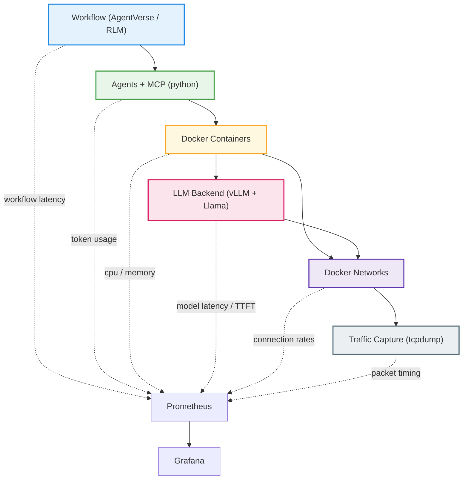

# Agentic Traffic Testbed

A testbed to study how **agentic software** (LLM-powered agents with tools) generates traffic patterns that differ from non-agentic workloads.

The goal is to characterise how agentic workflows behave across the stack: request interarrival distributions, burstiness, RTT, flow durations, and the relationship between semantic workflow decisions (orchestration mode, tool use, agent fan-out) and packet/flow-level network behaviour.

Runs entirely on a **single GPU server** using **Docker containers** to simulate a multi-node setup.

---

## Table of contents

- [1. Architecture](#1-architecture)
- [2. Repository layout](#2-repository-layout)
- [3. Quickstart](#3-quickstart)
- [4. Agent endpoints](#4-agent-endpoints)
- [5. Agent config and roles](#5-agent-config-and-roles)
- [6. Monitoring](#6-monitoring)
- [7. Experiment runner](#7-experiment-runner)
- [8. Benchmark integrations](#8-benchmark-integrations)
  - [MARBLE (MultiAgentBench)](#marble-multiagentbench)
- [9. Shared GPU usage](#9-shared-gpu-usage)

---

## 1. Architecture


```mermaid
flowchart TB

%% STACK
WORKFLOW["Workflow (AgentVerse / RLM)"]
AGENTS["Agents + MCP (python)"]
CONTAINERS["Docker Containers"]
LLM_BACKEND["LLM Backend (vLLM + Llama)"]
NETWORK["Docker Networks"]
CAPTURE["Traffic Capture (tcpdump)"]

%% MAIN STACK
WORKFLOW --> AGENTS
AGENTS --> CONTAINERS
CONTAINERS --> LLM_BACKEND
NETWORK --> CAPTURE

%% NETWORK PATHS
CONTAINERS --> NETWORK
LLM_BACKEND --> NETWORK

%% MONITORING
PROM["Prometheus"]
GRAF["Grafana"]

PROM --> GRAF

%% METRICS
WORKFLOW -. workflow latency .-> PROM
AGENTS -. token usage .-> PROM
CONTAINERS -. cpu / memory .-> PROM
LLM_BACKEND -. model latency / TTFT .-> PROM
NETWORK -. connection rates .-> PROM
CAPTURE -. packet timing .-> PROM

%% STYLING
style WORKFLOW fill:#e3f2fd,stroke:#1e88e5,stroke-width:2px
style AGENTS fill:#e8f5e9,stroke:#43a047,stroke-width:2px
style CONTAINERS fill:#fff8e1,stroke:#f9a825,stroke-width:2px
style LLM_BACKEND fill:#fce4ec,stroke:#d81b60,stroke-width:2px
style NETWORK fill:#ede7f6,stroke:#5e35b1,stroke-width:2px
style CAPTURE fill:#eceff1,stroke:#546e7a,stroke-width:2px
```

The testbed runs in **distributed mode** (default): each logical service gets an isolated Docker network plus every service joins a shared `inter_agent_network` (`172.23.0.0/24`) that carries all cross-service traffic.

| Service | agent_a_network | agent_b_network | llm_network | tools_network | inter_agent_network |
|---|---|---|---|---|---|
| agent-a | 172.20.0.10 | — | — | — | 172.23.0.10 |
| agent-b | — | 172.21.0.10 | — | — | 172.23.0.20 |
| agent-b-2 | — | 172.21.0.11 | — | — | 172.23.0.21 |
| agent-b-3 | — | 172.21.0.12 | — | — | 172.23.0.22 |
| agent-b-4 | — | 172.21.0.13 | — | — | 172.23.0.23 |
| agent-b-5 | — | 172.21.0.14 | — | — | 172.23.0.24 |
| llm-backend | — | — | 172.22.0.10 | — | 172.23.0.30 |
| mcp-tool-db | — | — | — | 172.24.0.10 | 172.23.0.40 |
| prometheus | — | — | — | — | 172.23.0.70 |
| grafana | — | — | — | — | 172.23.0.71 |
| cadvisor | — | — | — | — | 172.23.0.72 |
| docker-mapping-exporter | — | — | — | — | 172.23.0.73 |

All IPs are overridable via environment variables in `infra/.env`. The conditions of each network can be manipulated to introduce delay, jitter, and packet loss. See [docs/networking.md](docs/networking.md) for full network topology details.

### Services

| Service | Role |
|---------|------|
| **agent-a** | Orchestrator — recruits Agent B experts, calls LLM, uses MCP tools |
| **agent-b** (×1–5 replicas) | Worker — receives subtasks from Agent A, calls LLM |
| **llm-backend** | vLLM server (Llama) — serves inference to all agents |
| **mcp-tool-db** | MCP tool server (database / synthetic tools) |
| **prometheus / grafana / cadvisor** | Metrics collection and visualisation |
| **docker-mapping-exporter** | Translates raw bridge/cgroup IDs → human-readable service names |

### Metrics

| Component | What is measured |
|-----------|-----------------|
| **Workflow** | Workflow latency, inter-agent timing |
| **Agents + MCP** | Token usage, request latency, tool invocation rate |
| **Containers** | CPU, memory, network I/O (cAdvisor) |
| **LLM Backend** | Token throughput, model latency, TTFT, in-flight requests |
| **Networking** | TCP bytes/packets, flow durations, SYN RTTs by service pair |
| **Traffic Capture** | Raw packet timestamps via `tcpdump` on the inter-agent bridge |

See [docs/architecture_diagrams/layers.md](docs/architecture_diagrams/layers.md) and [docs/networking.md](docs/networking.md) for full details.

---

## 2. Repository layout

```text
.
├── agents/
│   ├── agent_a/          # Orchestrator (AgentVerse, multi-hop, parallel scenarios)
│   ├── agent_b/          # Worker agent
│   ├── common/           # Shared MCP client, telemetry, tracing
│   ├── templates/        # AgentVerse workflow and contract templates
│   └── Dockerfile
├── llm/
│   ├── serve_llm.py      # vLLM server with Prometheus metrics
│   ├── config/
│   └── Dockerfile
├── infra/
│   ├── docker-compose.yml                        # Simple (single-network) mode
│   ├── docker-compose.distributed.yml            # Distributed (multi-network) mode
│   ├── docker-compose.monitoring*.yml            # Prometheus / Grafana / cAdvisor
│   └── monitoring/
│       ├── prometheus.yml
│       └── grafana/provisioning/                 # Datasources + auto-provisioned dashboard
├── scripts/
│   ├── deploy/           # Deployment and lifecycle scripts
│   ├── experiment/       # Experiment runner, query scripts, plotting
│   ├── monitoring/       # tcp_metrics_collector.py, docker_mapping_exporter.py, health_check.py
│   ├── setup/            # Prerequisites (Docker)
│   └── traffic/          # Traffic collection helpers
├── benchmarks/
│   └── marble/           # MARBLE benchmark adapter (loader, topology, scorer, runner)
├── data/
│   ├── agentverse/       # AgentVerse experiment runs
│   ├── marble/           # MARBLE experiment runs
│   └── agentbench/       # AgentBench experiment runs
├── docs/
│   ├── monitoring.md
│   ├── networking.md
│   ├── agentverse/
│   │   ├── implementation.md     # AgentVerse 4-stage workflow design and API
│   │   └── experiment_runner.md  # Bulk experiment pipeline, plots, interpretation
│   ├── benchmarks/
│   │   ├── README.md             # Cross-benchmark comparison and integration pattern
│   │   ├── marble.md             # MARBLE integration details
│   │   ├── agentbench.md
│   │   ├── oolong.md
│   │   └── mcp_universe.md
│   └── architecture_diagrams/
└── logs/
```

---

## 3. Quickstart

```bash
# 1. Configure environment
cd infra
cp .env.example .env                                 # Docker / infra settings (HF_TOKEN, model, etc.)
cp .env.experiment.example .env.experiment           # Benchmark / experiment settings (paths, scenarios)
# Edit both files to match your machine (HF_TOKEN, RLM_REPO_PATH, OOLONG_ROOT, etc.)

# 2. Deploy (distributed mode with monitoring)
cd ..
./scripts/deploy/deploy.sh

# 3. Check health
python scripts/monitoring/health_check.py
```

- **Grafana**: `http://localhost:3001` (admin/admin) — *Agentic Traffic Testbed* dashboard
- **Prometheus**: `http://localhost:9090`
- **Agent A**: `http://localhost:8101`

See [`infra/README.md`](infra/README.md) for full deployment options, LLM config, and environment variables.

---

## 4. Agent endpoints

**Agent A** (port 8101):

| Endpoint | Method | Description |
|----------|--------|-------------|
| `/task` | POST | Main task endpoint. Scenario controls whether Agent A calls Agent B and/or LLM. |
| `/agentverse` | POST | AgentVerse 4-stage workflow (recruitment → decision → execution → evaluation). |
| `/rlm` | POST | RLM workflow: LLM operates in a Python REPL loop, calling Agent B as tools and recursively calling itself. |

**Agent B** (ports 8102–8106):

| Endpoint | Method | Description |
|----------|--------|-------------|
| `/subtask` | POST | Receives subtasks from Agent A; calls LLM and returns result. |
| `/discuss` | POST | Alias for `/subtask`; used in AgentVerse collaborative discussions. |

### Quick smoke tests

```bash
# Agent A — single hop (Agent A → LLM)
curl -X POST http://localhost:8101/task \
  -H "Content-Type: application/json" \
  -d '{"task":"Summarise what this testbed is for."}'

# Agent A — multi-hop (Agent A → Agent B → LLM)
curl -X POST http://localhost:8101/task \
  -H "Content-Type: application/json" \
  -d '{"task":"Produce a 3-step plan for RTT metrics.","scenario":"agentic_multi_hop"}'

# Agent A — full AgentVerse workflow (4 stages)
curl -X POST http://localhost:8101/agentverse \
  -H "Content-Type: application/json" \
  -d '{"task":"Design a traffic analysis experiment."}'

# Agent A — RLM workflow (REPL loop, plain baseline)
curl -s -X POST http://localhost:8101/rlm \
  -H "Content-Type: application/json" \
  -d '{"task":"What is the capital of France?","scenario":"rlm_simple"}' \
  | python3 -m json.tool

# Agent A — RLM workflow (recursive REPL, Agent B as tool)
curl -s -X POST http://localhost:8101/rlm \
  -H "Content-Type: application/json" \
  -d '{"task":"List the 3 longest rivers in Europe and their lengths.","scenario":"rlm_recursive","max_depth":1,"agent_count":2}' \
  | python3 -m json.tool

# Agent B directly
curl -X POST http://localhost:8102/subtask \
  -H "Content-Type: application/json" \
  -d '{"subtask":"List two example MCP tool calls."}'
```

Logs for every request are written to `logs/`:
- `logs/llm_calls.jsonl` — per-call token counts, latency, agent ID, task ID
- `logs/node1_agentA_AgentA-RLM.log` — RLM event stream (iteration/subcall events)
- `logs/benchmarks/` — benchmark runner JSONL output

Traces are available in Jaeger at `http://localhost:16686` (service `agent-a`, operation `agent_a.rlm_workflow`).

---

## 5. Agent config and roles

### Payload fields

**`/task`** (Agent A):
- `task` (required): User task text.
- `scenario`: `agentic_simple` (default), `agentic_multi_hop`, or `agentic_parallel`.
- `agent_a_role`, `agent_a_contract`: Optional role and contract for Agent A.
- `agent_b_role`, `agent_b_contract`: Optional role and contract for downstream Agent B.
- `agent_count`, `agent_b_workers`: For `agentic_parallel`; control worker count and per-worker endpoints/roles.

**`/agentverse`** (Agent A):
- `task` (required): Triggers full 4-stage workflow.

**`/rlm`** (Agent A):
- `task` (required): Task text fed into the RLM REPL.
- `scenario`: `rlm_simple` (no REPL, plain LLM baseline), `rlm_recursive` (default), or `rlm_parallel`.
- `max_depth`: REPL recursion depth (default 1; capped at 3). Ignored for `rlm_simple`.
- `max_iterations`: Max REPL loop turns (default 30, cap 100).
- `max_tokens`: Optional cumulative token budget (0 = unlimited).
- `max_timeout`: Optional wall-clock timeout in seconds (0 = unlimited).
- `agent_count`: Number of Agent B workers to expose as tools (0 = none).
- `agent_b_workers`: Explicit list of `{endpoint, role, contract}` worker specs (overrides `agent_count`).

**`/subtask`** and **`/discuss`** (Agent B):
- `subtask` (required): Subtask text.
- `scenario`: Optional label for telemetry.
- `agent_b_role`, `agent_b_contract`: Optional per-request role and contract.

### Agent roles

Agent A acts as the **orchestrator** and recruits Agent B instances dynamically:

| Role | Description |
|------|-------------|
| **orchestrator** | Agent A; recruits experts, coordinates decision-making, synthesises results. |
| **planner** | Plans approach; acts as solver in vertical (solver + reviewers) mode. |
| **researcher** | Gathers information. |
| **executor** | Executes specific subtasks. |
| **critic** | Critiques proposals; reviewer in vertical mode. |
| **summarizer** | Summarises discussion or results. |

All Agent B instances run the same code; roles are passed per-request. The **AgentVerse orchestrator** (`agents/agent_a/orchestrator.py`) implements:

1. **Expert recruitment** – LLM decides which roles and how many agents.
2. **Collaborative decision** – Horizontal (democratic discussion) or vertical (solver + reviewers).
3. **Action execution** – Experts execute subtasks in parallel.
4. **Evaluation** – Assess results; optionally iterate with feedback.

---

## 6. Monitoring

When `ENABLE_MONITORING=1`, the stack deploys **Prometheus**, **Grafana**, and **cAdvisor**, and starts the **TCP metrics collector** on the host.

### Components

| Component | What it does |
|-----------|-------------|
| **cAdvisor** | Container-level CPU, memory, network I/O |
| **llm-backend `/metrics`** | `llm_*` latency, TTFT, token throughput, in-flight requests |
| **TCP metrics collector** (`scripts/monitoring/tcp_metrics_collector.py`) | Captures traffic on the `inter_agent_network` bridge via `tcpdump`; exports `tcp_bytes_total`, `tcp_packets_total`, `tcp_flow_duration_seconds_bucket`, `tcp_rtt_handshake_seconds_bucket` labelled by `src_service`/`dst_service` |
| **Docker mapping exporter** (`scripts/monitoring/docker_mapping_exporter.py`) | Translates `br-xxxx` bridge IDs and cgroup scope paths to human-readable service names for Grafana panels |

### Dashboard

The **Agentic Traffic Testbed** dashboard (`http://localhost:3001`) is auto-provisioned and covers:

- Overview (active containers, network TX/RX, LLM request rate)
- Network Traffic (bytes/packets by Docker network)
- Resource Usage (CPU and memory per container)
- Service-level Network / TCP (bytes, flow durations, SYN RTTs by service pair)
- AI Performance / LLM (latency p50/p95, TTFT, tokens/s, in-flight)
- Interarrival Interpretation (mean interarrival time, burstiness coefficient)
- Traffic Characterisation (interarrival jitter, queue wait distribution)
- LLM Configuration (vLLM settings, KV-cache concurrency, error counts)

See [docs/monitoring.md](docs/monitoring.md) for the full PromQL reference, how to start the TCP collector manually, and tips on enabling per-container cAdvisor metrics.

See [docs/monitoring.md](docs/monitoring.md) for how interarrival time is derived and interpreted alongside latency and queue metrics.

---

## 7. Experiment runner

Repeatable bulk-collection pipeline for interarrival time and related metrics.

```bash
# Run 5 iterations of each task (math-problem + coding-task)
./scripts/experiment/run_experiment.sh -n 5
```

Each run saves the AgentVerse JSON response, scrapes all Prometheus metrics, and generates matplotlib plots and an interarrival time distribution analysis.

See [docs/agentverse/experiment_runner.md](docs/agentverse/experiment_runner.md) for full usage, output layout, CSV schema, and how to extend tasks or metrics.

---

## 8. Benchmark integrations

The testbed integrates multiple industry-standard agentic benchmarks so that the network-level telemetry it collects corresponds to real cognitive workloads. All benchmarks route through the local LLM backend and the testbed's instrumented agent pipeline.

| Benchmark | Task type | Interaction | Metric | Doc |
|-----------|-----------|-------------|--------|-----|
| **AgentBench** | OS / SQL / KG / Embodied | Multi-turn tool-use (function calling) | SR, F1 | [docs/benchmarks/agentbench.md](docs/benchmarks/agentbench.md) |
| **OOLONG** | Long-context aggregation | Single-shot (or parallel fan-out) | Exponential decay, exact match | [docs/benchmarks/oolong.md](docs/benchmarks/oolong.md) |
| **MCP-Universe** | Real-world MCP tool execution (6 domains) | Multi-turn ReAct via MCP | SR, AE, AS | [docs/benchmarks/mcp_universe.md](docs/benchmarks/mcp_universe.md) |
| **MARBLE** | Multi-agent collaboration (research / coding / bargaining) | Multi-agent (star / chain / tree / graph) | Task score, coordination score | [docs/benchmarks/marble.md](docs/benchmarks/marble.md) |

See [docs/benchmarks/README.md](docs/benchmarks/README.md) for a full comparison: how each benchmark differs in traffic pattern, when to use each, and how to compare outputs across benchmarks.

### MARBLE (MultiAgentBench)

MARBLE ([Zhu et al. 2025](https://arxiv.org/abs/2503.01935), ACL 2025) evaluates multi-agent coordination across four topology types and multiple cognitive domains. The testbed **reimplements MARBLE's coordination logic over Docker HTTP agents** rather than running its in-process engine — this means every agent-to-agent interaction becomes a real TCP flow measurable by the testbed's telemetry pipeline.

**Topologies**: `star`, `chain`, `tree`, `graph`
**Domains in use**: `research`, `coding`, `bargaining`
**Requires**: MARBLE repo cloned locally (set `MARBLE_REPO_PATH` in `infra/.env`)

```bash
# Clone MARBLE
git clone https://github.com/ulab-uiuc/MARBLE ../MARBLE

# Run a single combo (5 tasks, research domain, graph topology)
source .venv/bin/activate
python -m benchmarks.marble.runner \
  --domain research --topology graph --max-tasks 5 --verbose

# Run a full experiment (all 4 topologies × 3 domains, with cron crash recovery)
./scripts/experiment/marble/run_marble_aggregated_experiment.sh -n 20
```

**Per-task outputs** (written to `data/marble/<experiment>/tasks/<ts>_<domain>_<topology>_<uuid>/`):

| File | Contents |
|------|----------|
| `meta.json` | Task metadata, agent count, timestamps, scores |
| `response.json` | Full agent outputs, iteration history, score details |
| `calls.csv` | Per-LLM-call record: timestamps, tokens, latency, IAT |

**Experiment-level outputs** (`data/marble/<experiment>/`):

| File / dir | Contents |
|------------|----------|
| `runs.jsonl` | One line per task — index of all task runs |
| `results/<domain>_<topology>.jsonl` | Aggregate task scores and stats per combo |
| `plots/iat/` | IAT histogram, ECDF, boxplot per topology |
| `plots/results/` | Score/duration/fan-out comparison plots |
| `plots/tokens_concurrency/` | Token distributions, concurrency timeline |
| `logs/marble_llm_calls.jsonl` | Raw per-call log (source for IAT and concurrency analysis) |

See [docs/benchmarks/marble.md](docs/benchmarks/marble.md) for architecture details, design decisions, and how to compare against the paper's reported scores.

---

## 9. Shared GPU usage

```bash
nvidia-smi
nvidia-smi --query-compute-apps=pid,process_name,used_memory --format=csv
```

Avoid killing processes you don't own. If GPU memory is tight, lower model size or run off-peak.
