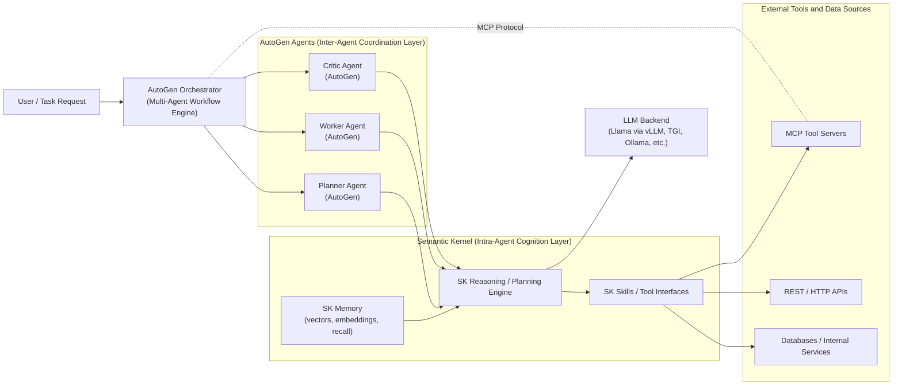

```mermaid
flowchart LR

    %% User entrypoint
    User["User / Task Request"] --> Orchestrator["AutoGen Orchestrator<br>(Multi-Agent Workflow Engine)"]

    %% AutoGen agents (inter-agent layer)
    subgraph AutoGenAgents["AutoGen Agents (Inter-Agent Coordination Layer)"]
        Planner["Planner Agent<br>(AutoGen)"]
        Worker["Worker Agent<br>(AutoGen)"]
        Critic["Critic Agent<br>(AutoGen)"]
    end

    Orchestrator --> Planner
    Orchestrator --> Worker
    Orchestrator --> Critic

    %% Semantic Kernel inside each agent (intra-agent layer)
    subgraph SemanticKernel["Semantic Kernel (Intra-Agent Cognition Layer)"]
        SKMemory["SK Memory<br>(vectors, embeddings, recall)"]
        SKPlanner["SK Reasoning / Planning Engine"]
        SKSkills["SK Skills / Tool Interfaces"]
    end

    SKMemory --> SKPlanner
    SKPlanner --> SKSkills

    %% Each AutoGen agent uses SK internally
    Planner --> SKPlanner
    Worker --> SKPlanner
    Critic --> SKPlanner

    %% LLM backend used by SK
    LLM["LLM Backend<br>(Llama via vLLM, TGI, Ollama, etc.)"]
    SKPlanner --> LLM

    %% Tooling layer (SK → MCP → Tools)
    subgraph ToolsLayer["External Tools and Data Sources"]
        MCPTools["MCP Tool Servers"]
        HTTPAPI["REST / HTTP APIs"]
        DB["Databases / Internal Services"]
    end

    SKSkills --> MCPTools
    SKSkills --> HTTPAPI
    SKSkills --> DB

    %% MCP is a protocol between tools and agent frameworks
    MCPTools -. "MCP Protocol" .- Orchestrator

```