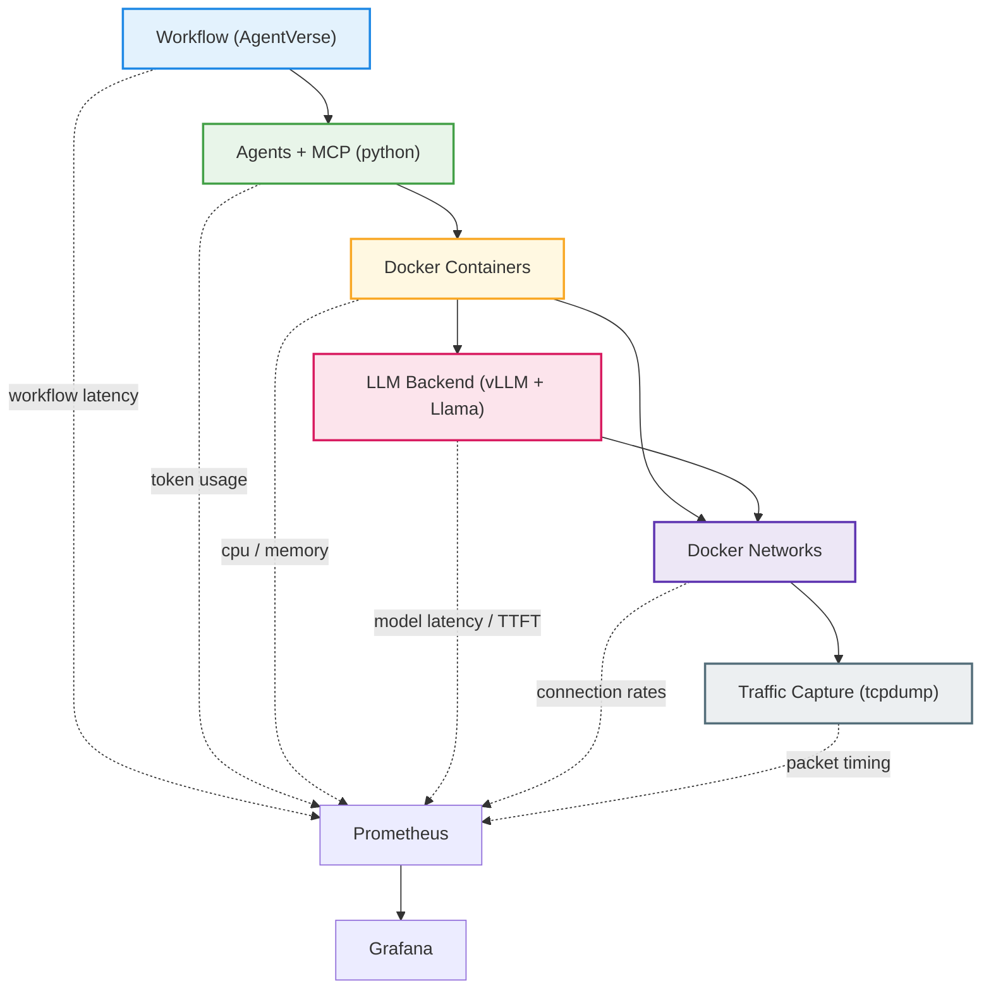
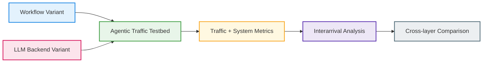
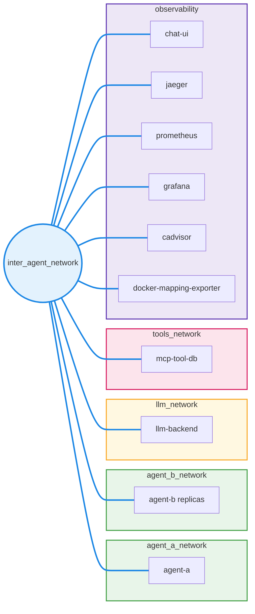
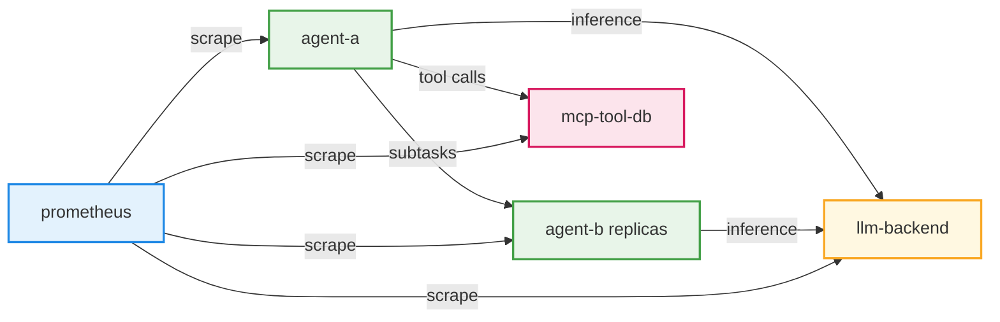

# Architecture

# Experiment setup

# Networking

# Agent communication flows

# Fixed IP address reference

| Service | agent_a_network | agent_b_network | llm_network | tools_network | inter_agent_network |
|---|---|---|---|---|---|
| agent-a | 172.20.0.10 | — | — | — | 172.23.0.10 |
| agent-b | — | 172.21.0.10 | — | — | 172.23.0.20 |
| agent-b-2 | — | 172.21.0.11 | — | — | 172.23.0.21 |
| agent-b-3 | — | 172.21.0.12 | — | — | 172.23.0.22 |
| agent-b-4 | — | 172.21.0.13 | — | — | 172.23.0.23 |
| agent-b-5 | — | 172.21.0.14 | — | — | 172.23.0.24 |
| llm-backend | — | — | 172.22.0.10 | — | 172.23.0.30 |
| mcp-tool-db | — | — | — | 172.24.0.10 | 172.23.0.40 |
| chat-ui | — | — | — | — | 172.23.0.50 |
| jaeger | — | — | — | — | 172.23.0.60 |
| prometheus | — | — | — | — | 172.23.0.70 |
| grafana | — | — | — | — | 172.23.0.71 |
| cadvisor | — | — | — | — | 172.23.0.72 |
| docker-mapping-exporter | — | — | — | — | 172.23.0.73 |

All IPs are overridable via environment variables in `infra/.env`
(e.g. `AGENT_A_IP`, `LLM_BACKEND_INTER_IP`, etc.).

# Metrics

| Component             | Metric                              | Description / Meaning                                  |
| --------------------- | ----------------------------------- | ------------------------------------------------------ |
| **Workflow**          | Workflow latency                    | Time between workflow steps or agent interactions      |
|                       | Inter-agent timing                  | Delays between agents sending/receiving messages       |
| **Agents + MCP**      | Token usage                         | Number of tokens consumed per agent action             |
|                       | Request latency                     | Time taken to execute agent request or tool invocation |
|                       | Agent actions                       | Count / type of agent operations executed              |
|                       | Tool invocation rate (MCP)          | How frequently MCP tools are called by agents          |
| **Containers**        | CPU usage                           | Container CPU consumption                              |
|                       | Memory usage                        | Container memory footprint                             |
|                       | Network I/O                         | Bytes sent/received by container                       |
| **LLM Backend**       | Token throughput                    | Tokens processed per second by model                   |
|                       | Model latency                       | Time to generate responses from LLM                    |
|                       | Request rate                        | Number of requests handled per second                  |
|                       | API latency / errors (external LLM) | Response time and failure count for external servers   |
| **Networking**        | Connection counts                   | Number of active TCP/UDP connections                   |
|                       | Packet rates                        | Packets per second transmitted on docker networks      |
|                       | Interarrival time                   | Time between consecutive packets                       |
| **Traffic Capture**   | Packet timestamps                   | Raw timestamps of captured packets                     |
|                       | Flow distribution                   | Packet flows between agents / containers               |
|                       | Traffic burstiness                  | Measure of traffic clustering / variability            |
