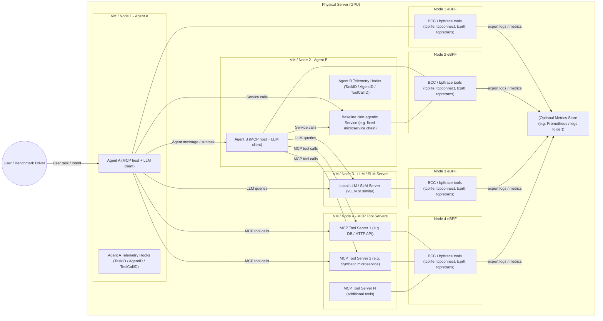
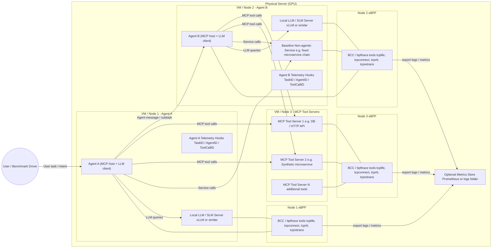

# Architecture using a single LLM server backend

```mermaid
flowchart LR
    %% Physical host
    subgraph Host["Physical Server (GPU)"]
        
        %% Virtual node 1: Agent A
        subgraph Node1["VM / Node 1 - Agent A"]
            AgentA["Agent A (MCP host + LLM client)"]
            AgentALogger["Agent A Telemetry Hooks (TaskID / AgentID / ToolCallID)"]
        end

        %% Virtual node 2: Agent B
        subgraph Node2["VM / Node 2 - Agent B"]
            AgentB["Agent B (MCP host + LLM client)"]
            BaselineSvc["Baseline Non-agentic Service (e.g. fixed microservice chain)"]
            AgentBLogger["Agent B Telemetry Hooks (TaskID / AgentID / ToolCallID)"]
        end

        %% Virtual node 3: Local LLM / SLM server
        subgraph Node3["VM / Node 3 - LLM / SLM Server"]
            LLM["Local LLM / SLM Server (vLLM or similar)"]
        end

        %% Virtual node 4: MCP Tool Servers
        subgraph Node4["VM / Node 4 - MCP Tool Servers"]
            Tool1["MCP Tool Server 1 (e.g. DB / HTTP API)"]
            Tool2["MCP Tool Server 2 (e.g. Synthetic microservice)"]
            Tool3["MCP Tool Server N (additional tools)"]
        end

        %% eBPF observability on each node
        subgraph Obs1["Node 1 eBPF"]
            BCC1["BCC / bpftrace tools (tcplife, tcpconnect, tcprtt, tcpretrans)"]
        end

        subgraph Obs2["Node 2 eBPF"]
            BCC2["BCC / bpftrace tools (tcplife, tcpconnect, tcprtt, tcpretrans)"]
        end

        subgraph Obs3["Node 3 eBPF"]
            BCC3["BCC / bpftrace tools (tcplife, tcpconnect, tcprtt, tcpretrans)"]
        end

        subgraph Obs4["Node 4 eBPF"]
            BCC4["BCC / bpftrace tools (tcplife, tcpconnect, tcprtt, tcpretrans)"]
        end

        %% Optional metrics store on host
        MetricsDB["(Optional Metrics Store (e.g. Prometheus / logs folder))"]
    end

    %% Traffic paths (logical)
    User((User / Benchmark Driver)) -->|User task / intent| AgentA
    AgentA -->|Agent message / subtask| AgentB
    AgentA -->|MCP tool calls| Tool1
    AgentA -->|MCP tool calls| Tool2
    AgentB -->|MCP tool calls| Tool1
    AgentB -->|MCP tool calls| Tool2
    AgentA -->|Service calls| BaselineSvc
    AgentB -->|Service calls| BaselineSvc

    AgentA -->|LLM queries| LLM
    AgentB -->|LLM queries| LLM

    %% eBPF data flow
    AgentA --- BCC1
    AgentB --- BCC2
    BaselineSvc --- BCC2
    LLM --- BCC3
    Tool1 --- BCC4
    Tool2 --- BCC4
    Tool3 --- BCC4

    BCC1 -->|export logs / metrics| MetricsDB
    BCC2 -->|export logs / metrics| MetricsDB
    BCC3 -->|export logs / metrics| MetricsDB
    BCC4 -->|export logs / metrics| MetricsDB
```

# Architecture using separate LLM server backends:

```mermaid
flowchart LR
    %% Physical host
    subgraph Host["Physical Server (GPU)"]
        
        %% Virtual node 1: Agent A + local LLM
        subgraph Node1["VM / Node 1 - Agent A"]
            AgentA["Agent A (MCP host + LLM client)"]
            LLM1["Local LLM / SLM Server vLLM or similar"]
            AgentALogger["Agent A Telemetry Hooks TaskID / AgentID / ToolCallID"]
        end

        %% Virtual node 2: Agent B + local LLM
        subgraph Node2["VM / Node 2 - Agent B"]
            AgentB["Agent B (MCP host + LLM client)"]
            BaselineSvc["Baseline Non-agentic Service e.g. fixed microservice chain"]
            LLM2["Local LLM / SLM Server vLLM or similar"]
            AgentBLogger["Agent B Telemetry Hooks TaskID / AgentID / ToolCallID"]
        end

        %% Virtual node 3: MCP Tool Servers (separate from agents)
        subgraph Node3["VM / Node 3 - MCP Tool Servers"]
            Tool1["MCP Tool Server 1 e.g. DB / HTTP API"]
            Tool2["MCP Tool Server 2 e.g. Synthetic microservice"]
            Tool3["MCP Tool Server N additional tools"]
        end

        %% eBPF observability on each node
        subgraph Obs1["Node 1 eBPF"]
            BCC1["BCC / bpftrace tools tcplife, tcpconnect, tcprtt, tcpretrans"]
        end

        subgraph Obs2["Node 2 eBPF"]
            BCC2["BCC / bpftrace tools tcplife, tcpconnect, tcprtt, tcpretrans"]
        end

        subgraph Obs3["Node 3 eBPF"]
            BCC3["BCC / bpftrace tools tcplife, tcpconnect, tcprtt, tcpretrans"]
        end

        %% Optional metrics store on host
        MetricsDB["Optional Metrics Store Prometheus or logs folder"]
    end

    %% Traffic paths (logical)
    User((User / Benchmark Driver)) -->|User task / intent| AgentA
    AgentA -->|Agent message / subtask| AgentB
    AgentA -->|MCP tool calls| Tool1
    AgentA -->|MCP tool calls| Tool2
    AgentB -->|MCP tool calls| Tool1
    AgentB -->|MCP tool calls| Tool2
    AgentA -->|Service calls| BaselineSvc
    AgentB -->|Service calls| BaselineSvc

    AgentA -->|LLM queries| LLM1
    AgentB -->|LLM queries| LLM2

    %% eBPF data flow
    AgentA --- BCC1
    LLM1 --- BCC1

    AgentB --- BCC2
    BaselineSvc --- BCC2
    LLM2 --- BCC2

    Tool1 --- BCC3
    Tool2 --- BCC3
    Tool3 --- BCC3

    BCC1 -->|export logs / metrics| MetricsDB
    BCC2 -->|export logs / metrics| MetricsDB
    BCC3 -->|export logs / metrics| MetricsDB 
```