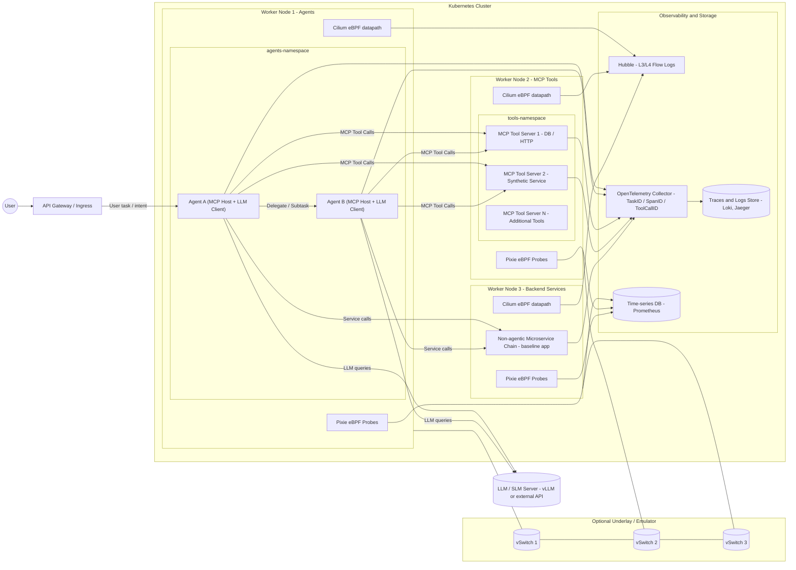

```mermaid
flowchart LR
    %% Client entry
    User((User)) --> Ingress[API Gateway / Ingress]

    %% Top-level cluster
    subgraph K8s["Kubernetes Cluster"]
        
        %% Agents namespace on Node 1
        subgraph Node1["Worker Node 1 - Agents"]
            subgraph AgentsNS["agents-namespace"]
                AgentA["Agent A (MCP Host + LLM Client)"]
                AgentB["Agent B (MCP Host + LLM Client)"]
            end

            Cilium1["Cilium eBPF datapath"]
            Pixie1["Pixie eBPF Probes"]
        end

        %% MCP Tools on Node 2
        subgraph Node2["Worker Node 2 - MCP Tools"]
            subgraph ToolsNS["tools-namespace"]
                Tool1["MCP Tool Server 1 - DB / HTTP"]
                Tool2["MCP Tool Server 2 - Synthetic Service"]
                ToolN["MCP Tool Server N - Additional Tools"]
            end

            Cilium2["Cilium eBPF datapath"]
            Pixie2["Pixie eBPF Probes"]
        end

        %% Baseline / backend services on Node 3
        subgraph Node3["Worker Node 3 - Backend Services"]
            Backend["Non-agentic Microservice Chain - baseline app"]
            Cilium3["Cilium eBPF datapath"]
            Pixie3["Pixie eBPF Probes"]
        end

        %% Observability plane
        subgraph Obs["Observability and Storage"]
            Hubble["Hubble - L3/L4 Flow Logs"]
            OTel["OpenTelemetry Collector - TaskID / SpanID / ToolCallID"]
            MetricsDB[(Time-series DB - Prometheus)]
            TracesDB[(Traces and Logs Store - Loki, Jaeger)]
        end
    end

    %% Optional LLM/SLM server (local or external)
    LLM[(LLM / SLM Server - vLLM or external API)]

    %% Optional network emulator underlay
    subgraph Underlay["Optional Underlay / Emulator"]
        Sw1[(vSwitch 1)]
        Sw2[(vSwitch 2)]
        Sw3[(vSwitch 3)]
    end

    %% Traffic paths (logical)
    Ingress -->|User task / intent| AgentA
    AgentA -->|Delegate / Subtask| AgentB
    AgentA -->|MCP Tool Calls| Tool1
    AgentA -->|MCP Tool Calls| Tool2
    AgentB -->|MCP Tool Calls| Tool1
    AgentB -->|MCP Tool Calls| Tool2
    AgentA -->|Service calls| Backend
    AgentB -->|Service calls| Backend

    AgentA -->|LLM queries| LLM
    AgentB -->|LLM queries| LLM

    %% eBPF -> observability
    Cilium1 --> Hubble
    Cilium2 --> Hubble
    Cilium3 --> Hubble

    Pixie1 --> MetricsDB
    Pixie2 --> MetricsDB
    Pixie3 --> MetricsDB

    %% App-level traces
    AgentA --> OTel
    AgentB --> OTel
    Tool1 --> OTel
    Tool2 --> OTel
    Backend --> OTel
    OTel --> TracesDB

    %% Underlay wiring (conceptual)
    Node1 --- Sw1
    Node2 --- Sw2
    Node3 --- Sw3
    Sw1 --- Sw2
    Sw2 --- Sw3

```