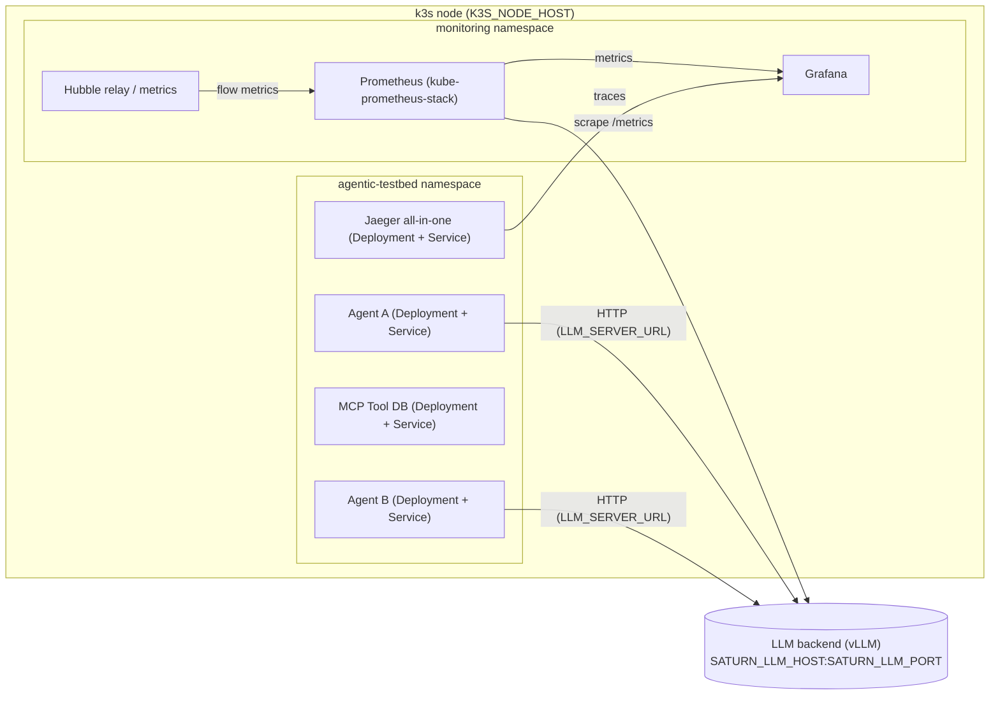

# k3s + Cilium + Hubble Deployment (Experimental)

This directory contains **experimental Kubernetes manifests** for running the
Agentic Traffic Testbed on a **single-node k3s cluster** with **Cilium + Hubble**
and **kube-prometheus-stack**.

The goal is to replace the Docker Compose–based deployment with:

- k3s (orchestration)
- Cilium (CNI)
- Hubble (network observability)
- kube-prometheus-stack (Prometheus + Grafana + kube-state-metrics)

## Architecture: k3s observability node + external LLM backend

At a high level, these manifests assume:

- A **single-node k3s cluster** running the agents, MCP tools, Prometheus, Grafana, Hubble, and Jaeger.
- An **external LLM backend** (vLLM) running on a separate host (or the same host) referenced by
  `SATURN_LLM_HOST` / `SATURN_LLM_PORT` in `infra/.env`.



Key points:

- Agent pods talk to the LLM via `LLM_SERVER_URL=http://${SATURN_LLM_HOST}:${SATURN_LLM_PORT}/chat`.
- Prometheus (inside the cluster) scrapes LLM performance metrics from `http://${SATURN_LLM_HOST}:${SATURN_LLM_PORT}/metrics`.
- Cilium + Hubble provide L3/L4 flow visibility for **in-cluster** traffic; agent → LLM calls appear as egress flows to the external LLM host.

## 1. Prerequisites

- A Linux host with:
  - k3s installed (server role)
  - Cilium installed via Helm, using `infra/k8s/cluster/cilium-values.yaml`
- `kubectl` and `helm` configured to talk to the k3s cluster.

> These manifests are **not** wired into the existing `scripts/deploy` flow yet;
> apply them manually while iterating.

## 2. Namespaces and Cluster Components

1. Create the application namespace:

```bash
kubectl apply -f infra/k8s/base/namespace.yaml
```

2. Install Cilium (from repo root, adjust version as needed):

```bash
helm repo add cilium https://helm.cilium.io/
helm repo update

helm install cilium cilium/cilium \
  --namespace kube-system \
  -f infra/k8s/cluster/cilium-values.yaml
```

3. Install kube-prometheus-stack:

```bash
helm repo add prometheus-community https://prometheus-community.github.io/helm-charts
helm repo update

helm install kube-prometheus prometheus-community/kube-prometheus-stack \
  --namespace monitoring --create-namespace \
  -f infra/k8s/monitoring/kube-prometheus-values.yaml

kubectl apply -f infra/k8s/monitoring/hubble-servicemonitor.yaml
```

## 3. Workloads

Build and load container images for the in-cluster components so they are visible to k3s (for example, by
pushing to a registry or loading into containerd). The manifests assume local
image names:

- `agent-a:local`
- `agent-b:local`
- `mcp-tool-db:local`

Then deploy the core testbed services into the `agentic-testbed` namespace:

```bash
kubectl apply -f infra/k8s/workloads/jaeger.yaml
kubectl apply -f infra/k8s/workloads/agent-b.yaml
kubectl apply -f infra/k8s/workloads/agent-a.yaml
kubectl apply -f infra/k8s/workloads/mcp-tool-db.yaml
```

## 4. Accessing Services

The following services are exposed as NodePorts on the k3s node (`K3S_NODE_HOST` in `infra/.env`):

- Agent A: `http://$K3S_NODE_HOST:30101` (`/task`, `/agentverse`)
- Agent B: `http://$K3S_NODE_HOST:30102` (`/subtask`)
- MCP db tool: `http://$K3S_NODE_HOST:30201`
- Jaeger UI: `http://$K3S_NODE_HOST:31686`

The LLM backend runs externally on `$SATURN_LLM_HOST:$SATURN_LLM_PORT` and is called via `LLM_SERVER_URL` from the agents.

You can reuse the existing smoke tests from `README.md` by pointing them at
these NodePort URLs instead of the Docker ports.

## 5. Observability

- Grafana (from kube-prometheus-stack) is exposed as a NodePort on `3001`:

  ```bash
  http://$K3S_NODE_HOST:3001
  ```

- Jaeger is available via the `jaeger` service:

  - UI: `http://jaeger:16686` (inside the cluster)
  - OTLP HTTP: `http://jaeger:4318/v1/traces`

The application pods are configured to send OTLP traces to `http://jaeger:4318/v1/traces`.

